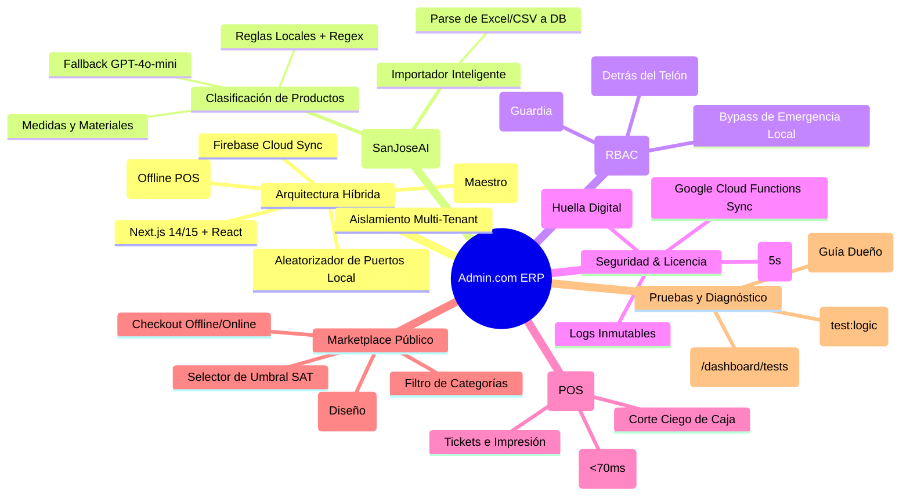

# Mapa de Funcionalidades — Admin.com ERP

A continuación se presenta la topología funcional del sistema, organizada por el núcleo operativo, herramientas de aseguramiento y la lógica comercial.

---

## Detalle de Capacidades Especiales

### 1. El Cerebro Híbrido y Red Local
El sistema puede desplegarse en una sucursal física. El **Nodo Maestro** levanta un puerto aleatorio libre para evitar colisiones y los **Nodos Esclavos** (dispositivos de personal en la tienda) localizan la IP y el puerto de forma automática. Si falla internet, la base de datos local SQLite asume el control del inventario y las ventas, sincronizando con Firestore una vez que regresa la conexión.

### 2. Clasificador e Importador IA
Combina el análisis de palabras clave y expresiones regulares en el cliente con un servicio en la nube asistido por Inteligencia Artificial para sugerir categorías de productos. El importador PRO lee archivos Excel de sistemas heredados e inserta miles de artículos clasificados de forma automatizada y rápida.

### 3. Login Invisible & Roles
El acceso administrativo no se expone públicamente. Empleados y clientes entran por el mismo formulario `/login`. El sistema analiza el rol e inyecta las redirecciones invisibles a los dashboards operativos privados, evitando que se sospeche del panel administrativo.

### 4. Perros Guardianes y Ofuscación
Se prohíbe duplicar registros de usuario bajo los mismos datos y se limita rígidamente la existencia de un único Super Administrador por licencia activa. Los logs de auditoría quedan grabados de forma inmutable. La memoria interna se re-ofusca cada 5 segundos para prevenir lectura y ataques por bots de ingeniería inversa.

### 5. Configuración Efímera (Wizard)
El Setup Wizard acompaña de forma interactiva la primera instalación del ERP. Enseña al dueño cómo operar los cambios en vivo y forzar la creación del Super Admin único. Una vez culminado, el Wizard se auto-elimina/desactiva del sistema de forma definitiva.

### 6. Licenciamiento Estándar vs PRO (Cloud Functions & Multi-Tenancy)
La versión **Estándar Gratuita** ofrece POS local, catálogo básico y roles locales para facilitar la captación inicial de clientes. La versión **PRO** (pago único $1,500 MXN o suscripción) valida claves de forma centralizada usando una **Google Cloud Function** asociada al Machine ID y aislando los datos en subcolecciones multi-tenant inquebrantables. Habilita facturación SAT controlada por un **selector de monto mínimo** (el dueño decide a partir de qué cantidad timbrar facturas, deslindando al sistema de reclamos), además de habilitar logs forenses, repartos y el editor Canvas Pro.