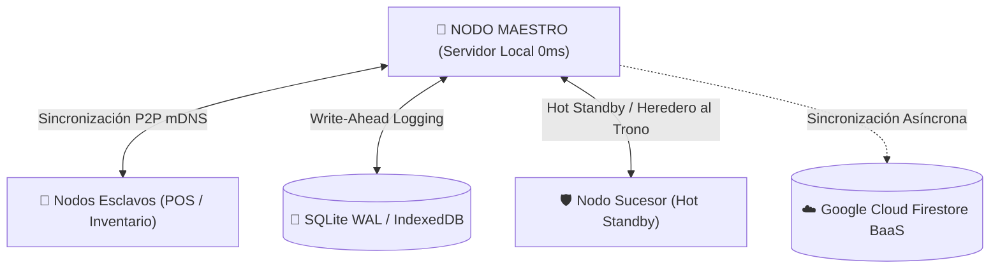

[MONETIZACION.md](https://github.com/user-attachments/files/31485881/MONETIZACION.md)

# 📜 BUNKKER E.C.O.S. (Ecosistema Comercial Offline Sincronizado)

**Memoria Técnica Descriptiva de Arquitectura, Ingeniería de Sistemas e Registro INDAUTOR**

[Uploading [PATENTE_NODOS_BANDERA.md](https://github.com/user-attachments/files/31485882/PATENTE_NODOS_BANDERA.md)[HISTORIA_Y_RESUMEN_PROYECTO.md](https://github.com/user-attachments/files/31485901/HISTORIA_Y_RESUMEN_PROYECTO.md)
[FUNCTIONALITY_MAP.md](https://github.com/user-attachments/files/31485900/FUNCTIONALITY_MAP.md)
[FILE_MANIFEST.md](https://github.com/user-attachments/files/31485898/FILE_MANIFEST.md)
[CONTRIBUTING.md](https://github.com/user-attachments/files/31485897/CONTRIBUTING.md)
[BUNKKER_ECOS_MEMORIA_TECNICA_INDAUTOR.md](https://github.com/user-attachments/files/31485896/BUNKKER_ECOS_MEMORIA_TECNICA_INDAUTOR.md)
[BUNKKER_ECOS_ESPECIFICACION_TECNICA.md](https://github.com/user-attachments/files/31485895/BUNKKER_ECOS_ESPECIFICACION_TECNICA.md)
[ARCHITECTURE.md](https://github.com/user-attachments/files/31485894/ARCHITECTURE.md)
[ADDMIN_PROJECT_STORY.md](https://github.com/user-attachments/files/31485893/ADDMIN_PROJECT_STORY.md)
[toc.md](https://github.com/user-attachments/files/31485892/toc.md)
[sistema.md](https://github.com/user-attachments/files/31485891/sistema.md)
[SECURITY.md](https://github.com/user-attachments/files/31485890/SECURITY.md)
[ROLES_MAP.md](https://github.com/user-attachments/files/31485889/ROLES_MAP.md)
[PROJECT_TREE.md](https://github.com/user-attachments/files/31485888/PROJECT_TREE.md)
[PROJECT_STRUCTURE.md](https://github.com/user-attachments/files/31485887/PROJECT_STRUCTURE.md)
[POLICIES.md](https://github.com/user-attachments/files/31485886/POLICIES.md)
[PITCH_COMERCIAL_SAAS.md](https://github.com/user-attachments/files/31485883/PITCH_COMERCIAL_SAAS.md)
MONETIZACION.md…]()

---

- **Denominación de la Obra:** BUNKKER E.C.O.S. (Ecosistema Comercial Offline Sincronizado)
- **Titular de los Derechos:** Luis Felipe Durán Salinas (Philip Durán) / Brecha Soluciones S.A. de C.V.
- **Campo de Aplicación:** Planificación de Recursos Empresariales (ERP), Puntos de Venta (POS) masivos y Orquestación Logística Descentralizada Local-First.
- **Instancia Destinataria:** Instituto Nacional del Derecho de Autor (INDAUTOR) — México.
- **Entorno Tecnológico:** TypeScript, Next.js 15 (App Router), React 19, Electron Core Node Environment, SQLite Embebido, Prisma ORM, Firebase / Cloud Firestore BaaS.

---

## 🏛️ Resumen de Arquitectura e Ingeniería de Sistemas

### ⚡ Pilares de la Invención Registrada:
1. **Matriz Operacional Descentralizada (D.O.M.):** Transacciones inmutables mediante cadena de hashes $H_n = \text{SHA256}(id_n \times monto_n \times timestamp_n \times usuario_n \times H_{n-1})$.
2. **Arquitectura Multi-Vault (SQLite + Prisma + Firestore):** Operación ultrarrápida local (<70ms) con respaldo asíncrono pasivo en la nube.
3. **Mecanismo Hot Standby ("Heredero al Trono"):** Conmutación por error en menos de 15s ante caídas del servidor maestro sin condición de cerebro dividido (split-brain).
4. **Sesiones Offline Prolongadas:** Renovación silenciosa mediante `refreshToken` encriptado localmente para reconexiones sin interrupción.

---

## 📑 Documentación Legal y Técnica Completa

- 📜 [BUNKKER_ECOS_MEMORIA_TECNICA_INDAUTOR.md](./docs/BUNKKER_ECOS_MEMORIA_TECNICA_INDAUTOR.md) — Memoria Técnica Descriptiva Completa INDAUTOR.
- 📜 [PATENTE_NODOS_BANDERA.md](./docs/PATENTE_NODOS_BANDERA.md) — Registro de Patente Nodal Terrestre.
- 🏗️ [ARCHITECTURE.md](./docs/ARCHITECTURE.md) — Especificación Arquitectónica.

---

## 💳 Licenciamiento y Derechos Reservados

© 2026 **Brecha Soluciones S.A. de C.V. / Luis Felipe Durán Salinas**. Todos los derechos reservados.  
Obra registrada ante el Instituto Nacional del Derecho de Autor (INDAUTOR).
