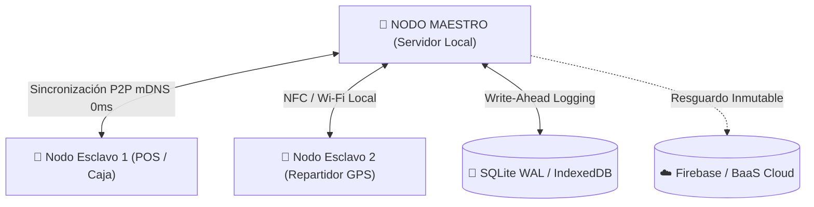

<div align="center">

# 🐝 BUNKKER E.C.O.S ERP — Ecosistema Comercial Local-First

**Plataforma de Operaciones Simplificadas, Punto de Venta (POS) y Red P2P de Alta Concurrencia**

[](./LICENSE.md)
[](https://nextjs.org/)
[](https://react.dev/)
[](https://www.typescriptlang.org/)
[](./.github/workflows/ci-cd.yml)

---

</div>

## 📌 Visión General

**BUNKKER E.C.O.S ERP** es una arquitectura de software de alto rendimiento diseñada para operar **100% en redes locales (Wi-Fi/LAN) sin dependencia de internet**, con capacidad de sincronización síncrona en la nube (BaaS) y comunicación P2P entre sucursales.

---

## 🏛️ Arquitectura Nodal & Invención Patentada

El sistema utiliza la tecnología registrada de **Nodos Bandera Local-First**:



### ⚡ Innovaciones Clave:
1. **Nodos Bandera Wi-Fi / NFC:** Transferencia nodal instantánea y descubrimiento local sin gateway en la nube.
2. **Capa Terrestre Aislada:** Protocolo de datos de baja latencia firmado con criptografía HMAC SHA-256.
3. **Resguardo Cíclico en Núcleo:** Re-ofuscación periódica en memoria RAM (cada 5s) e historial de auditoría inalterable.

---

## 📑 Documentación Técnica & Patentes

- 📜 [PATENTE_NODOS_BANDERA.md](./docs/PATENTE_NODOS_BANDERA.md) — Registro de Propiedad Intelectual de Nodos Bandera.
- 🏗️ [ARCHITECTURE.md](./docs/ARCHITECTURE.md) — Especificación Arquitectónica del Sistema.
- 👥 [ROLES_MAP.md](./docs/ROLES_MAP.md) — Matriz de Roles (RBAC) y Seguridad.
- 📜 [PULL_REQUEST_TEMPLATE.md](./.github/PULL_REQUEST_TEMPLATE.md) — Plantilla Estándar de PRs.

---

## 🛠️ Instalación y Uso Local

```bash
# 1. Clonar el repositorio
git clone https://github.com/ataca3000/bunnkker-e.c.o.s-baas.git

# 2. Instalar dependencias
npm install

# 3. Iniciar entorno de desarrollo local
npm run dev
```

---

## 💳 Licenciamiento y Derechos Reservados

© 2026 **Brecha Soluciones DS / Luis Felipe Durán Salinas**. Todos los derechos reservados.  
Uso sujeto a términos y condiciones descritos en [LICENSE.md](./LICENSE.md).
