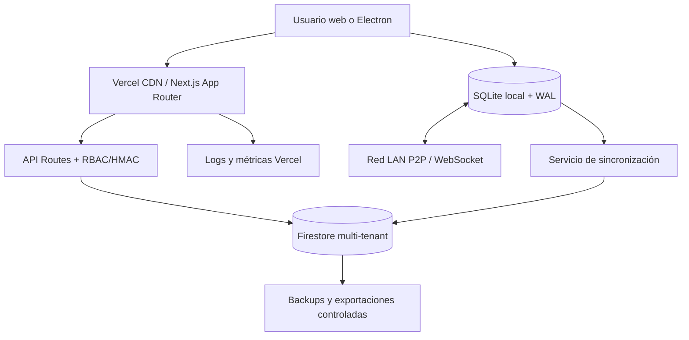

# Arquitectura del Sistema BUNKKER E.C.O.S ERP

## 1. Visión General

BUNKKER E.C.O.S (Ecosistema Comercial de Operaciones Simplificadas) es una plataforma integral de gestión de recursos empresariales (ERP) y Punto de Venta (POS) con diseño **Local-First**, soporte de red local P2P y sincronización automática en la nube (BaaS) mediante Firebase. El sistema está diseñado para funcionar en condiciones de conectividad inestable o nula, garantizando la continuidad operativa de los negocios.

## 2. Stack Tecnológico

### Frontend & Runtimes

* **Framework:** [Next.js 15](https://nextjs.org/) (App Router)
* **React:** React 19 (Tipado estático estricto y renderizado optimizado)
* **Entorno de Escritorio:** Electron (Distribución nativa para PC de mostrador)
* **Estado Global:** Zustand (`useERPStore` para datos unificados) con adaptadores `CartContext` y `AuthContext` para retrocompatibilidad de UI.
* **Sistema de Notificaciones:** Despachador de eventos `CustomEvent` global y contenedor `Framer Motion` (sin uso de `alert()` bloqueantes).

### Backend & Almacenamiento Local-First

* **Base de Datos Local:** SQLite (Prisma ORM) con cola de transacciones Write-Ahead Logging (WAL) offline.
* **Base de Datos Cloud:** Google Cloud Firestore (NoSQL, sincronización en tiempo real).
* **Autenticación:** Firebase Admin Auth y endpoints locales protegidos mediante firmas criptográficas.

## 3. Estructura del Código Fuente

```bash
src/
├── app/                  # Rutas y Vistas (Next.js App Router)
│   ├── dashboard/        # Panel administrativo protegido (RBAC)
│   ├── login/            # Autenticación unificada
│   └── api/              # Endpoints API (Verificación, Facturación, Reportes)
├── components/           # Componentes UI Reutilizables
│   ├── admin/            # KPICard, TrendBadge, ModuleSection y tablas admin
│   └── AdminAsistente.tsx # Módulo de Asistencia Técnica (Chatbot con IA)
├── context/              # Gestión de Estado (Patrones Provider de compatibilidad)
├── store/                # Zustand Stores (Estado unificado y reactivo principal)
├── lib/                  # Lógica de Negocio y Utilidades
│   ├── apiAuth.ts        # Validador de sesión firmada con HMAC
│   ├── license.ts        # Sistema de Licencias y Fingerprint físico (node-machine-id)
│   ├── localSync.ts      # Sincronización P2P por mDNS + WebSockets
│   └── audit.ts          # Sistema de Logs de Auditoría Inmutables
```

## 4. Patrones de Diseño Implementados

### A. Local-First con Write-Ahead Logging (WAL)

El sistema opera de forma autónoma sin conexión a internet. Las operaciones se guardan localmente en SQLite. Las transacciones pendientes de sincronización se encolan en una cola de Write-Ahead Logging (WAL) en `localStorage` (limitada a 500 registros para evitar quota overflow) y se reintentan de forma cíclica al recuperar la conexión.

### B. Seguridad de Cookies con Firmas Criptográficas (HMAC SHA-256)

Para prevenir la manipulación de roles (vulnerabilidad de bypass en cliente), el sistema firma la cookie de rol (`msj-role`) mediante un HMAC SHA-256 (`msj-role-sig`) utilizando la variable `INTERNAL_API_SECRET`. El middleware de Next.js y los helpers de la API verifican la firma de manera sincrónica en cada petición.

### C. Descubrimiento y Sincronización P2P en Red Local

Usando `multicast-dns` (mDNS) y WebSockets, el **Nodo Maestro** (servidor local de la tienda) anuncia su presencia y los **Nodos Esclavos** se conectan automáticamente en la red local Wi-Fi/LAN, permitiendo actualización de inventarios en tiempo real sin salir a internet.

### D. Estrategia de Seguridad (Defense in Depth)

1. **Nivel Aplicación (Cliente):** `LicenseGuard.tsx` (Validación de licencia vinculada al HWID real de la máquina vía IPC).
2. **Nivel Datos:** Validación de tipos en TypeScript, tipado estructurado de auditoría forense y control de transacciones ACID en Prisma.
3. **Nivel Acceso:** Middleware de Next.js con validación RBAC (roles `superadmin`, `admin`, `sales`, `delivery`, `carga_descarga`, etc.) verificado contra firmas HMAC de servidor.

---

## 5. Arquitectura de Producción



### Responsabilidades

| Componente | Responsabilidad | No debe hacer |
|---|---|---|
| Cliente web/Electron | UI, captura offline y estado local | Confiar en roles solo del cliente |
| Next.js API | Validación, autorización, operaciones idempotentes | Exponer secretos o aceptar `tenantId` sin validar |
| SQLite/WAL | Continuidad y cola local | Marcar sincronizado antes de confirmación |
| Firestore | Registro cloud multi-tenant y tiempo real | Servir como sustituto de controles RBAC |
| Sincronizador P2P | Replicar entre nodos autorizados | Abrir puertos públicos automáticamente |
| Vercel | Hosting, previews, producción y logs | Provisionar tenants mediante `/api/deploy` |

### Variables por entorno

- `INTERNAL_API_SECRET`: firma HMAC de sesiones internas; secreto.
- `DATABASE_URL`: SQLite local o configuración equivalente del runtime; nunca commitear archivos de base de datos.
- Firebase Admin/client variables: credenciales y configuración gestionadas fuera del repositorio.
- `NEXT_PUBLIC_*`: únicamente valores seguros para el navegador.

La lista exacta debe mantenerse en Vercel Vars y validarse durante el checklist de producción. Los nombres de secretos no deben imprimirse en logs.

### Nota sobre aprovisionamiento

El endpoint `/api/deploy` actual es una simulación de orquestación: genera un identificador, guarda el registro en `tenants_registry` y devuelve un dominio/puerto ficticios. No crea una instancia real, namespace, DNS, contenedor ni proyecto Vercel; cualquier flujo de provisioning futuro debe usar una integración autorizada, idempotency keys y auditoría.

*Documentación de Arquitectura de BUNKKER E.C.O.S ERP v1.0-PRO*
