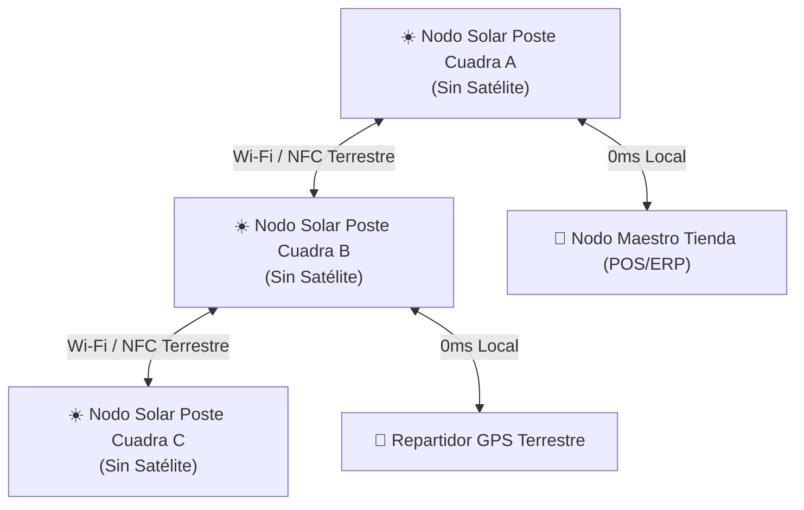

# 📜 PATENTE TÉCNICA Y ESPECIFICACIÓN DE PROPIEDAD INTELECTUAL

> **ID de Patente / Registro:** `PAT-BUNKKER-2026-ECOS-NODES-001`  
> **Titular de Derechos:** Luis Felipe Durán Salinas / Brecha Soluciones DS  
> **Sistema:** BUNKKER E.C.O.S ERP — Red Terrestre P2P Autónoma  
> **Estado:** Especificación Técnica Registrada (Código Visible — Licencia Comercial Reservada)

---

## 🏛️ 1. Reivindicaciones Principales de Invención (Claims)

Se reclama la propiedad intelectual, topología nodal y arquitectura de software sobre las siguientes invenciones:

### ☀️ Reivindicación 1: Independencia Absoluta de Infraestructura Espacial / Satelital
- **Capa Terrestre Autosustentable:** El sistema elimina completamente la dependencia de satélites en el espacio, repetidores orbitales o conexiones satelitales globales.
- **Nodos Nativos en Postes Urbanos (Energía Solar):** La infraestructura de comunicación se compone de **Nodos Terrestres alimentados por energía solar instalados en postes de las cuadras/barrios**, capaces de operar de forma autónoma durante las horas de luz solar y gestionar paquetes locales sin requerir red satelital o celular externa.

### 📶 Reivindicación 2: Nodos de Red Bandera Wi-Fi / NFC Local-First (0ms)
- Sistema de descubrimiento de nodos locales mediante beacons mDNS y transferencia de tokens vía NFC/Wi-Fi local sin pasar por gateways centralizados.

### 🛡️ Reivindicación 3: Capa de Transmisión de Datos Terrestres Aislados
- Protocolo de transporte local entre cuadras con firmas criptográficas HMAC SHA-256 para validación de paquetes en redes LAN/Wi-Fi cerradas.

### 🧠 Reivindicación 4: Resguardo Cíclico en el Núcleo (Memory Core Shielding)
- Re-ofuscación cíclica en memoria RAM (cada 5 segundos) y persistencia inmutable Write-Ahead Logging (WAL) en base de datos local SQLite.

---

## 📐 2. Topología Nodal de Cuadra (Postes Solares)



---

## 🔒 3. Matriz de Seguridad y Firma Digital de Archivos

Cada nodo de poste solar verifica la autenticidad de los paquetes mediante el identificador físico de hardware (*Machine ID*) y la firma SHA-256:

```
Firma Digital de Registro: SHA256(BUNKKER-ECOS-SOLAR-NODES-TERRESTRIAL-2026)
```

---

## ⚖️ 4. Aviso Legal de Uso Comercial

Queda estrictamente prohibida la descompilación, clonación, reventa o comercialización no autorizada de esta topología nodal terrestre sin contar con una Licencia Comercial Activa otorgada por **Brecha Soluciones DS**.
