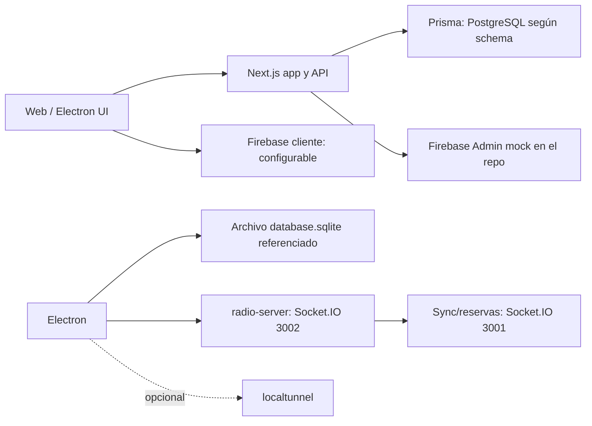

# Arquitectura real de BUNKKER E.C.O.S.

**Fecha de verificación:** 2026-09-09
**Propósito:** esta es la fuente de verdad técnica del repositorio. Describe lo
que el código versionado implementa hoy; no acredita despliegues externos,
clientes, disponibilidad, ni controles que no estén comprobados en el código.

## Convenciones de estado

| Etiqueta | Significado |
| --- | --- |
| **IMPLEMENTADO** | Hay código versionado que realiza la función indicada. No implica que esté endurecido ni desplegado en producción. |
| **PARCIAL** | Hay una base de código o interfaz, pero faltan controles, persistencia, integración o verificación necesaria para operar como producto. |
| **DISEÑO / ROADMAP** | Es una intención, comentario, documentación o dependencia; no hay una implementación verificable completa. |

## Inventario de componentes

| Componente | Existe | Estado actual verificado | Evidencia principal |
| --- | --- | --- | --- |
| Aplicación web / API Next.js | Sí | **IMPLEMENTADO.** Next.js App Router y rutas API están presentes. La configuración de Vercel declara el build y variables de PostgreSQL, pero no prueba un despliegue activo. | `package.json`, `src/app/api/`, `vercel.json` |
| Vercel API / producción | Configuración | **PARCIAL.** Hay `vercel.json`; el endpoint de aprovisionamiento es explícitamente simulado y no crea infraestructura real. | `vercel.json`, `src/app/api/deploy/route.ts` |
| Electron | Sí | **PARCIAL.** Existe el proceso principal, arranque del servidor, actualizador y configuración de `electron-builder`. Su ruta de base local no concuerda con el proveedor Prisma actual; ver «Decisión pendiente de datos». | `electron-main.js`, `package.json` |
| SQLite Edge | Referenciada | **PARCIAL / NO VERIFICADA.** Electron y el servidor de radio apuntan a archivos SQLite, pero el esquema Prisma y su migración declaran PostgreSQL. Además, no se versiona una base `prisma/dev.db`. Por tanto, no debe describirse como un Edge SQLite funcional con este esquema. | `electron-main.js`, `radio-server.js`, `prisma/schema.prisma`, `.gitignore` |
| PostgreSQL cloud | Sí, por configuración | **PARCIAL.** Prisma usa `provider = "postgresql"` y Vercel solicita URLs Neon/PostgreSQL. No hay prueba en el repositorio de una instancia o migración aplicada. | `prisma/schema.prisma`, `prisma/migrations/`, `vercel.json` |
| Firebase cliente | Sí | **IMPLEMENTADO (cliente configurable).** El SDK de Firebase se inicializa y deshabilita la red con credenciales dummy para el modo local. | `src/lib/firebase.ts` |
| Firebase Admin / cloud backend | Sustituto local | **PARCIAL.** `firebase-admin.ts` exporta una cápsula mock; por ello las rutas que lo usan no realizan operaciones reales de Firebase desde esta revisión. | `src/lib/firebase-admin.ts` |
| Radio server | Sí | **PARCIAL.** Socket.IO en el puerto 3002 y health check existen. La pertenencia se decide con el `role` enviado por el cliente y CORS acepta cualquier origen por defecto; no es una autoridad de personal verificable. | `radio-server.js` |
| Sync LAN / reservas flotantes | Sí | **PARCIAL.** Socket.IO en 3001 mantiene reservas en memoria y retransmite eventos. No hay autenticación por socket, autorización por evento, persistencia de reservas ni idempotencia. | `radio-server.js` |
| Túnel de nodos | Sí, condicionado | **PARCIAL.** Electron intenta iniciar `localtunnel` con reconexión; el propio código señala Cloudflared como trabajo pendiente y `localtunnel` no está declarado como dependencia directa. | `electron-main.js`, `package.json` |
| Swarm | Sí | **PARCIAL.** Existe el modelo `SwarmTransaction` y código de reservas; los estados son limitados y la identidad del nodo no está autenticada como autoridad. | `prisma/schema.prisma`, `radio-server.js` |
| Stripe checkout | Sí | **PARCIAL.** Se crea una Checkout Session, pero toma `amount` del cuerpo de la petición en lugar de calcularlo desde una orden del servidor. | `src/app/api/stripe/create-intent/route.ts` |
| Stripe webhook | Sí | **PARCIAL.** Hay manejo de eventos, pero puede hacer `JSON.parse` sin firma cuando falta secreto o cabecera y no se observa idempotencia de eventos. | `src/app/api/stripe/webhook/route.ts` |
| Firma de entrega | Sí, interfaz | **PARCIAL.** La UI captura una firma; el modelo Prisma `Order` no contiene un campo de firma ni una evidencia inmutable asociada. | `src/app/dashboard/delivery/components/DeliveryView.tsx`, `prisma/schema.prisma` |
| Fotografía de entrega | Sí, interfaz | **PARCIAL.** La UI permite capturar foto opcional; no hay modelo de evidencia/versionado en Prisma ni control de almacenamiento verificado. | `src/app/dashboard/delivery/components/DeliveryView.tsx`, `prisma/schema.prisma` |
| Auditoría | Sí | **PARCIAL.** Hay escritura de eventos Firestore y un JSONL local cifrado cuando es posible. No existe una cadena de hashes, ni un modelo de evento con actor/nodo/dispositivo, ni una garantía técnica contra actualización/borrado. | `src/lib/audit.ts`, `prisma/schema.prisma` |
| Backup local | Sí | **PARCIAL.** Existen rutas de backup y verificación. No se encontró una prueba automatizada de restaurar, continuar operación y resincronizar. | `src/app/api/backup/` |

## Topología observada



Las flechas muestran referencias de código, no una garantía de que todas las
piezas funcionen juntas. En particular, el archivo SQLite referenciado no es
compatible con el proveedor PostgreSQL declarado por Prisma sin separar el
cliente/esquema o cambiar la configuración.

## Decisión pendiente: datos Edge y Cloud

La arquitectura dual **no está resuelta en el estado actual**:

```text
EDGE   → SQLite (referenciado por Electron y radio-server)
CLOUD  → PostgreSQL (declarado por Prisma y Vercel)
SYNC   → Socket.IO + SyncQueue, sin contrato versionado ni autoridad de nodo
```

Esto es una inconsistencia de implementación, no una arquitectura dual ya
operativa. Antes de declarar soporte offline de producción, se debe elegir y
probar una de estas alternativas:

1. **Dual explícita:** un esquema/cliente SQLite para Edge, otro PostgreSQL
   para Cloud y un protocolo de sincronización versionado, idempotente y con
   resolución de conflictos.
2. **Cloud única:** eliminar el arranque SQLite y las afirmaciones de operación
   local persistente.
3. **Edge única temporal:** cambiar Prisma/migraciones a SQLite y aplazar el
   backend PostgreSQL hasta contar con sincronización real.

La decisión debe registrar: propietario de cada dato, operación que lo escribe,
`operationId`, política de conflicto, confirmación/ACK y recuperación tras
reinicio.

## Límites de autoridad actuales

**IMPLEMENTADO:** rutas HTTP seleccionadas verifican cookies de rol firmadas
con HMAC mediante helpers de API.

**PARCIAL:** el modelo no constituye todavía una cadena unificada
`device → auth → tenant → node → user → role → capability`. En particular:

- `join_radio` acepta un rol presentado por el cliente.
- Los eventos de sincronización y reserva no autentican ni autorizan cada
  operación.
- Los modelos principales llevan `tenantId`, pero el aislamiento no puede
  considerarse global hasta que cada consulta derive el ámbito desde la
  identidad autenticada, no de entradas del cliente.
- `AppConfig` sólo guarda un token de nube opcional; no modela credenciales de
  dispositivo ni capacidades.

## Modelo operativo actual

**IMPLEMENTADO:** `Product` mantiene `stock` y `reservedStock`; `Order` usa un
campo `status` de texto y `SyncQueue` conserva una cola básica con estados
`PENDING`, `PROCESSING` y `FAILED`.

**PARCIAL:** no existe `InventoryMovement`; por ello no es posible reconstruir
el stock exclusivamente desde movimientos. Tampoco hay una máquina de estados
centralizada para órdenes, requisitos de evidencia por transición,
`operationId` global, ni idempotencia persistente.

**DISEÑO / ROADMAP:** inventario espacial, cadena de custodia completa,
evidencia durable, movimientos encadenados por hash, outbox con ACK/reintentos
y conflictos deterministas.

## Reglas para documentación futura

1. Usar siempre una de las etiquetas **IMPLEMENTADO**, **PARCIAL** o
   **DISEÑO / ROADMAP** para cada afirmación técnica relevante.
2. No llamar a una interfaz una capacidad operativa si no hay persistencia,
   autorización y prueba correspondiente.
3. No declarar producción, disponibilidad, clientes, métricas de negocio o
   certificaciones sin una fuente verificable fuera del código.
4. Cuando cambie una integración, actualizar primero este documento y enlazar
   la prueba, despliegue o contrato que demuestre el nuevo estado.

## Próxima revisión P0

1. Resolver la decisión Edge/Cloud y añadir una prueba de arranque para cada
   runtime soportado.
2. Definir identidad autenticada de nodo/dispositivo y capacidades por evento.
3. Sustituir los importes Stripe controlados por el cliente y exigir firma de
   webhook salvo `STRIPE_LOCAL_TEST_MODE=true` explícito.
4. Introducir `operationId`, la máquina de estados de órdenes y
   `InventoryMovement` antes de ampliar funcionalidades de operación.
