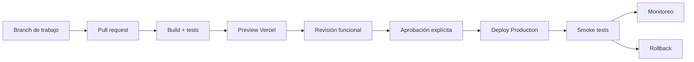
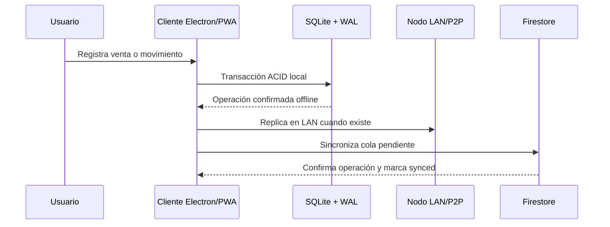

# Flujo de trabajo de producción

## Objetivo

Publicar BUNKKER E.C.O.S de forma repetible, auditable y reversible, manteniendo la operación local-first cuando la conectividad falle.

## Flujo de entrega

1. Crear una rama de trabajo; no publicar directamente en `main`.
2. Ejecutar `npm ci`, `npx prisma generate`, `npm run build` y las pruebas relevantes.
3. Abrir Preview y validar login, dashboard, APIs críticas y PWA.
4. Aprobar el cambio y promoverlo a Production desde Vercel.
5. Ejecutar smoke tests contra la URL de producción: página principal, login, dashboard protegido y APIs con autenticación.
6. Si un smoke test falla, revisar logs, congelar nuevas promociones y volver a la última versión estable.

## Variables y secretos

Configurar valores por entorno en Vercel. Nunca incluir secretos en Git, documentación, logs o respuestas API. La aplicación usa, según el módulo habilitado, `DATABASE_URL`, configuración Firebase, `INTERNAL_API_SECRET` y variables públicas `NEXT_PUBLIC_*`. Verificar nombres y disponibilidad desde la sección Vars antes de promover.

## Flujo operativo local-first

- SQLite es la fuente de continuidad operativa del dispositivo.
- Cada operación debe ser idempotente y conservar `tenantId`.
- La cola WAL se reintenta con backoff y se marca sincronizada solo tras confirmación cloud.
- Los conflictos se resuelven con una política explícita por entidad; nunca se sobrescribe silenciosamente una venta confirmada.

## Rollback y recuperación

- Identificar la versión estable anterior en Vercel.
- Promover esa versión o usar rollback del proyecto.
- Revisar logs de runtime y errores de sincronización.
- Reprocesar únicamente eventos WAL pendientes e idempotentes.
- Documentar causa, impacto y corrección en el pull request.

## Límites actuales

`/api/deploy` registra un tenant en Firestore y devuelve parámetros simulados; no crea proyectos Vercel, contenedores, DNS ni puertos públicos. Cualquier aprovisionamiento real debe implementarse con una integración autorizada y controles de idempotencia, permisos y auditoría.

## Checklist de salida

- [ ] Build de producción exitoso.
- [ ] Prisma Client generado.
- [ ] Variables de producción verificadas.
- [ ] Preview revisada en escritorio y móvil.
- [ ] Smoke tests ejecutados.
- [ ] Logs sin errores críticos.
- [ ] Plan de rollback identificado.
- [ ] Documentación actualizada.

## Arquitectura de referencia

La arquitectura técnica y sus responsabilidades están documentadas en [`ARCHITECTURE.md`](./ARCHITECTURE.md).
